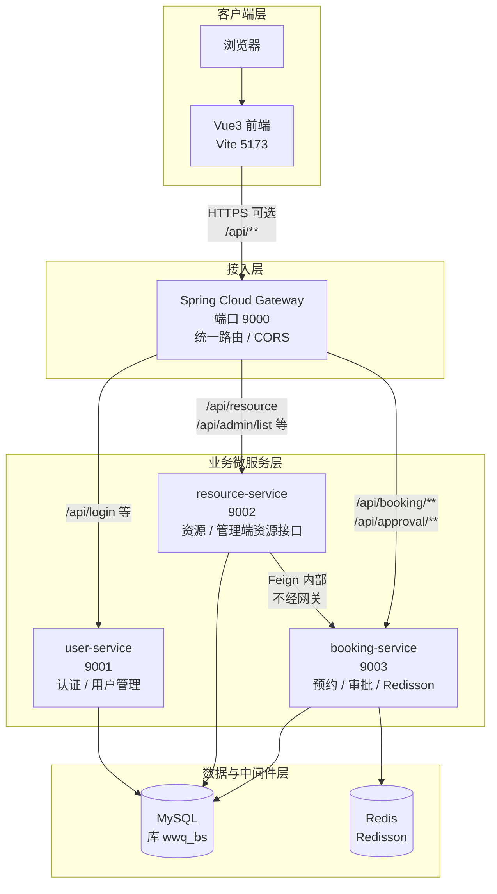

# 图：系统总体逻辑架构（微服务 + 网关）

**论文章节建议**：第 4 章「系统总体设计」— 逻辑架构 / 分层结构。

**正文可写 2～3 句（示例）**：  
浏览器仅访问网关端口；用户与权限相关请求转发至 user-service；资源展示与管理部分转发至 resource-service；预约与审批转发至 booking-service。resource-service 在聚合可用资源时通过 OpenFeign 调用 booking-service 的内部接口，实现跨服务冲突检测。
