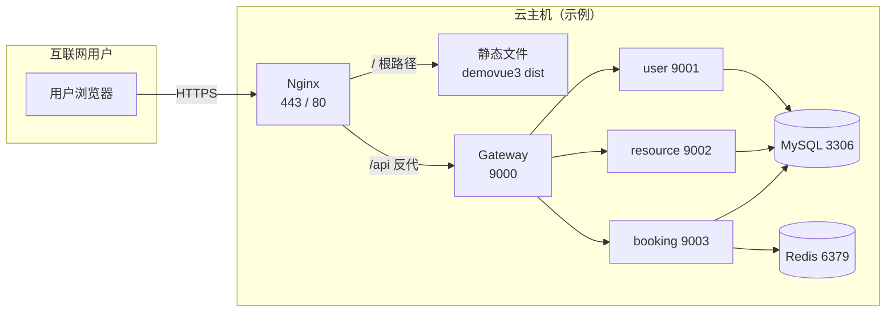

# 图：云服务器部署拓扑（示例）

**论文章节建议**：第 8 章「系统部署」— 部署拓扑 / 网络结构。

> 将文中 `your-domain.com` 换成你的域名；若仅用 IP，将 HTTPS 改为 HTTP 并说明用于演示。

**前端构建说明（论文一句话）**：  
生产环境前端通过 `npm run build` 生成静态资源，由 Nginx 托管；接口基地址 `VITE_API_BASE` 配置为 `https://your-domain.com`（与 Nginx 对外域名一致），由 Nginx 将 `/api` 转发至网关 `127.0.0.1:9000`。
