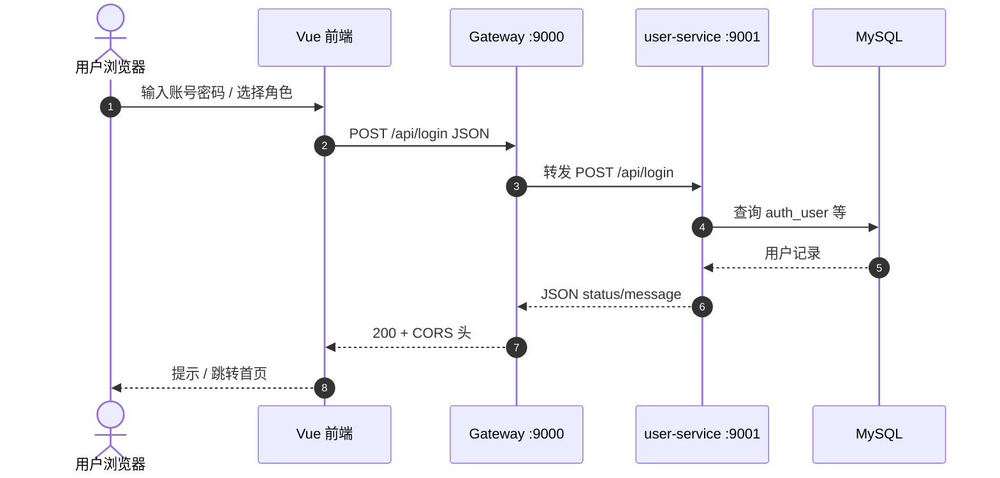

# 图：用户登录时序（经网关）

**论文章节建议**：第 6 章「系统实现」— 关键流程 / 安全接入。

```mermaid
sequenceDiagram
  autonumber
  actor User as 用户浏览器
  participant Vue as Vue 前端
  participant GW as Gateway :9000
  participant US as user-service :9001
  participant DB as MySQL

  User->>Vue: 输入账号密码 / 选择角色
  Vue->>GW: POST /api/login JSON
  GW->>US: 转发 POST /api/login
  US->>DB: 查询 auth_user 等
  DB-->>US: 用户记录
  US-->>GW: JSON status/message
  GW-->>Vue: 200 + CORS 头
  Vue-->>User: 提示 / 跳转首页
```

**创新点可写**：对外仅暴露网关，登录校验逻辑内聚于 user-service，便于后续在网关层叠加 JWT 校验而不改动前端入口。
