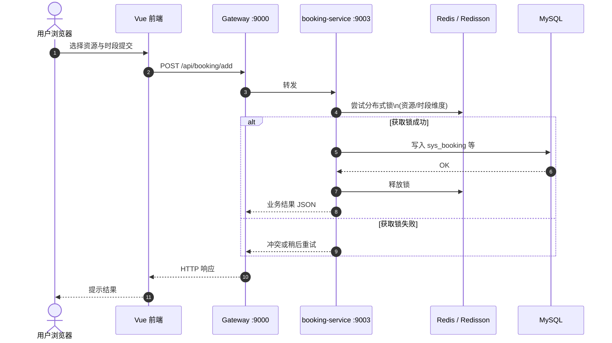

# 图：预约提交时序（经网关至 booking）

**论文章节建议**：第 6 章「预约业务实现」；可与「并发控制」小节呼应。

```mermaid
sequenceDiagram
  autonumber
  actor User as 用户浏览器
  participant Vue as Vue 前端
  participant GW as Gateway :9000
  participant BK as booking-service :9003
  participant RD as Redis / Redisson
  participant DB as MySQL

  User->>Vue: 选择资源与时段提交
  Vue->>GW: POST /api/booking/add
  GW->>BK: 转发
  BK->>RD: 尝试分布式锁\n(资源/时段维度)
  alt 获取锁成功
    BK->>DB: 写入 sys_booking 等
    DB-->>BK: OK
    BK->>RD: 释放锁
    BK-->>GW: 业务结果 JSON
  else 获取锁失败
    BK-->>GW: 冲突或稍后重试
  end
  GW-->>Vue: HTTP 响应
  Vue-->>User: 提示结果
```

说明：具体锁粒度与表字段以你 `booking-service` 实现为准；论文中可附关键类名、方法名（不必贴长代码）。
