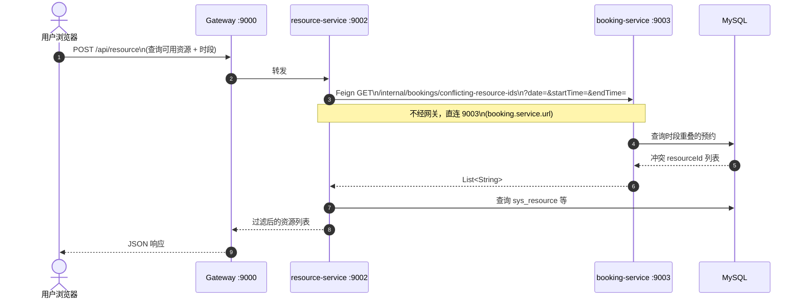

# 图：资源服务通过 Feign 查询预约冲突（内部调用）

**论文章节建议**：作为**创新点**之一 —「跨服务协同的资源冲突检测」；第 4～6 章均可引用。

```mermaid
sequenceDiagram
  autonumber
  actor User as 用户浏览器
  participant GW as Gateway :9000
  participant RS as resource-service :9002
  participant BK as booking-service :9003
  participant DB as MySQL

  User->>GW: POST /api/resource\n(查询可用资源 + 时段)
  GW->>RS: 转发
  RS->>BK: Feign GET\n/internal/bookings/conflicting-resource-ids\n?date=&startTime=&endTime=
  Note over RS,BK: 不经网关，直连 9003\n(booking.service.url)
  BK->>DB: 查询时段重叠的预约
  DB-->>BK: 冲突 resourceId 列表
  BK-->>RS: List<String>
  RS->>DB: 查询 sys_resource 等
  RS-->>GW: 过滤后的资源列表
  GW-->>User: JSON 响应
```

**正文可强调**：冲突判定数据以 booking-service 为权威来源，resource-service 负责聚合展示，避免在多个服务中重复维护「占用时段」逻辑。
