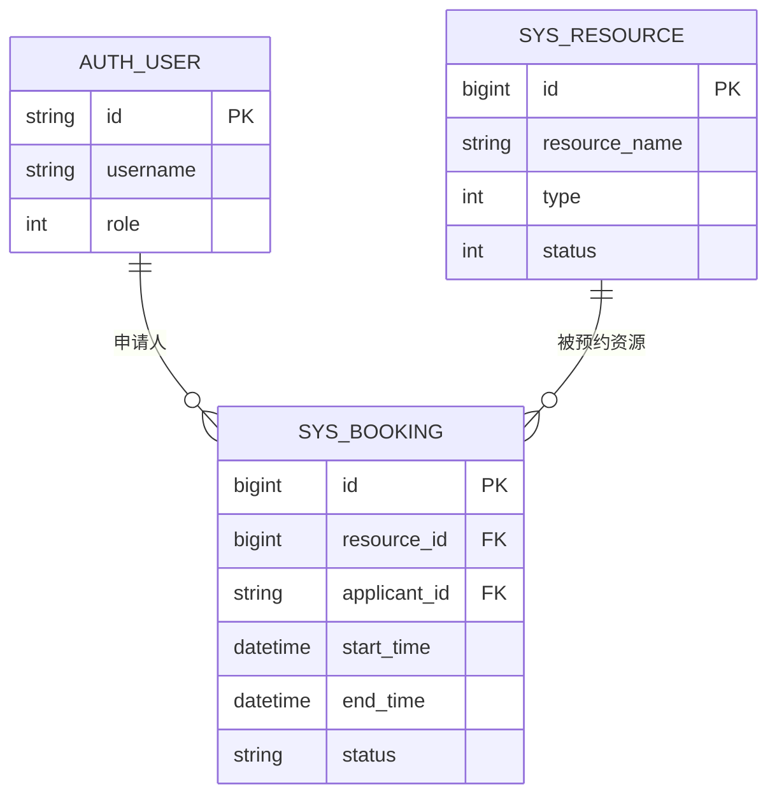

# 图：核心数据表关系（ER 示意）

**论文章节建议**：第 5 章「数据库设计」— 核心实体关系。

> 若 Mermaid 渲染报错，可在 mermaid.live 中删除部分关系行，只保留方框与主外键说明。

**扩展说明（正文文字，不必再画图）**：  
学籍/教师基础信息可分布在 `auth_student`、`auth_teacher` 等表，与 `auth_user` 通过业务主键关联；定时清理任务可使用 `booking_cleanup` 表。具体字段以数据库脚本为准。
